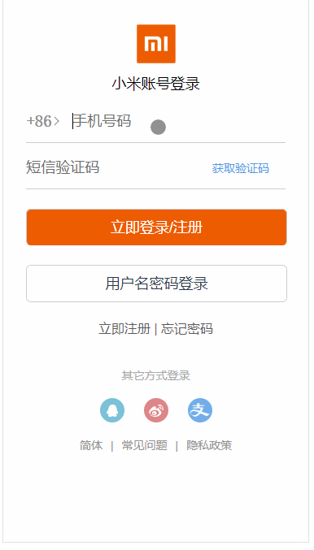

# vue_shop
vue.js实现商城

一. 环境配置


二. [移动端适配方案](https://github.com/HaitaoWang555/vue_shop/commit/39c7999332b1bd0b906a27d2b0ec5dad799f1e69)&&[方案地址](https://www.w3cplus.com/mobile/vw-layout-in-vue.html)

  1. 安装插件
  ```
  npm i cssnano cssnano-preset-advanced postcss-aspect-ratio-mini postcss-cssnext postcss-import postcss-px-to-viewport postcss-url postcss-viewport-units postcss-write-svg -D
  ```
  
  2. [配置postcss](.postcssrc.js)

  3. [添加buggyfill](https://github.com/HaitaoWang555/vue_shop/blob/39c7999332b1bd0b906a27d2b0ec5dad799f1e69/shop_app/public/index.html)

  4. [引入初始化css](https://github.com/HaitaoWang555/vue_shop/commit/b2add429932117450b961e2b99cf72ec379d2ed5)

三. 完成登录页面

  1. [完成登录页路由](https://github.com/HaitaoWang555/vue_shop/commit/2e74ce5349a76874b8da6379db66bd51a270f926)点击vue图标进入登录页
  2. [完成登录页样式](https://github.com/HaitaoWang555/vue_shop/commit/fad343747a76f64ca263e46387b356065ac33a77)
  3. [切换登录方式完成](https://github.com/HaitaoWang555/vue_shop/commit/5b0ec0d8017e50c76766407474c834f93963d7d3)
  4. [登录页完成](https://github.com/HaitaoWang555/vue_shop/commit/0a603f6b416d4630d966d365c1ee26ffe0a57055)效果如下

  

四. 商品首页展示
  1. [引入 vant 作为商城UI框架](https://github.com/HaitaoWang555/vue_shop/commit/3287f706b294089189b04a39cdb0b6dd9a77c709)
  2. 实现首页各个商品展示。

五. 底部导航
  1. [加入底部导航，完成路由配置，加入切换动画](https://github.com/HaitaoWang555/vue_shop/commit/9c4399cff6604ebda812b2f60e689ca08c868143)