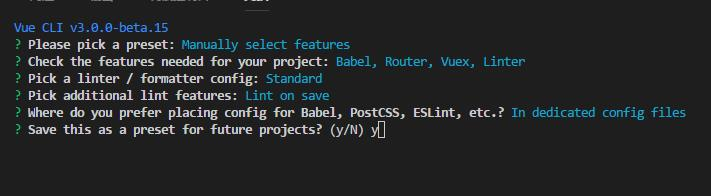

# vue_shop
vue.js实现商城

一. 环境配置



二. [移动端适配方案]()&&[方案地址](https://www.w3cplus.com/mobile/vw-layout-in-vue.html)

  1. 安装插件
  ```
  npm i cssnano cssnano-preset-advanced postcss-aspect-ratio-mini postcss-cssnext postcss-import postcss-px-to-viewport postcss-url postcss-viewport-units postcss-write-svg -D
  ```
  
  2. [配置postcss](.postcssrc.js)

  3. 添加buggyfill